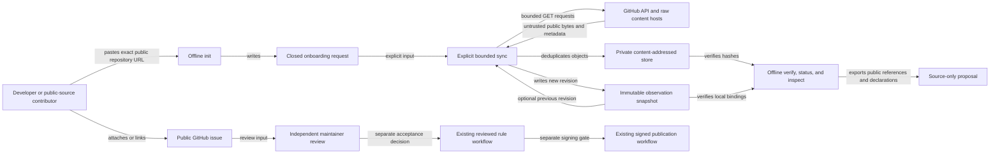

# RFC-0001: Local public-project knowledge onboarding

**Author:** Prufyx architecture review
**Date:** 2026-09-12
**Status:** Implemented
**Reviewers:** Maintainer, onboarding implementation reviewer

## Summary

Add a local, Go-only workflow that starts with a public GitHub repository URL,
collects a bounded snapshot of recent published release metadata and selected
commit-pinned changelog and license files, verifies the retained bytes offline,
and produces a source-only proposal suitable for a public issue. The workflow
does not require CNCF membership, repository control, manually calculated
digests, a hosted Prufyx service, or a compatibility rule. Source observations,
maintainer review, executable rules, and signed publication remain separate
states and artifacts.

## Motivation

The existing maintainer packages already enforce useful boundaries:
`sourcecapture` fetches declared immutable GitHub bytes, `sourcecorpus` verifies
content-addressed retained files, `contribution` validates review candidates,
and the knowledge publisher packages reviewed executable data. The current
developer path still starts after someone has found exact tags, commits, files,
hashes, and spans. It is therefore safe but not self-service.

There is no measured completion-time or abandonment data for public-project
onboarding. This RFC assumes that accepting one repository URL and generating
the hashes and immutable bindings locally will remove the largest avoidable
source of contributor effort. The first release should record command outcomes
and usability feedback without telemetry; the CLI remains local and has no
Prufyx upload path.

## Goals / Non-goals

Goals:

- Turn an exact public `https://github.com/OWNER/REPOSITORY` URL into a usable,
  private local evidence snapshot with one explicit network command.
- Bind repository identity, release IDs, tag references, peeled commits,
  commit-pinned files, object digests, and an optional parent snapshot digest.
- Detect tag rebinding and edited release bodies when comparing revisions.
- Retain public bytes without parsing or executing repository content.
- Generate a neutral source-only public proposal that does not assert CNCF
  membership, upstream ownership, maintainer approval, or compatibility.
- Reuse the current corpus verifier and keep existing rule schemas and signed
  package semantics unchanged.

Non-goals:

- Crawling arbitrary websites, cloning or building repositories, running
  repository code, or invoking a model.
- Accepting private repositories, GitHub Enterprise hosts, customer
  configuration, cluster objects, logs, credentials, or proprietary source.
- Inferring the official project, component relationship, license conclusion,
  version compatibility, support state, or rule behavior.
- Automatically opening issues, changing the catalogue, signing packages,
  publishing data, or operating a hosted synchronization service.
- Automatically ingesting repositories that publish only Git tags, a package
  index, or a changelog without any matching published GitHub Release. Those
  layouts need an explicit pinned-source capture in the first release.

## Detailed Design

### Architecture

The local workflow is the implemented first-release product boundary. A future
hosted service would introduce authentication, per-tenant storage, deletion,
abuse controls, quotas, secrets, and a new privacy review; it is not an
alternate deployment of this design.

### Data model

The following entities have distinct authority and lifecycle:

| Entity | Identity and contents | Authority |
| --- | --- | --- |
| Project | Stable GitHub numeric repository ID, canonical owner/name and URL | Identifies one GitHub repository observation; does not establish project ownership, foundation membership, component identity, or support |
| Request | Versioned closed schema containing repository URL, recent-release limit, optional tag prefix, optional changelog paths, and initial license disposition | Local operator intent only; created without network access and retained canonically in each snapshot |
| Observation | One bounded GitHub response or raw file, with request identity, observed time, response digest, and normalized fields | Records what one provider endpoint returned; does not authenticate semantics |
| Snapshot | Immutable canonical manifest, parent snapshot digest, observations, object digests, and verification receipt | Reproducible local evidence revision |
| Review | Separate maintainer-authored decision binding an exact snapshot or proposal digest, reviewer identity, license disposition, and scope | May accept references for a stated purpose; never supplied by the submitter as self-approval |
| Rule | Existing reviewed executable constraint and tests | Can affect scoped evaluator outcomes only after the current rule gates pass |
| Publication | Existing signed target and metadata | Authenticates distributed bytes under the selected trust root; does not make their source claims true |

The request and snapshot schemas are versioned with schema identifiers. Parsers
are closed, bounded, reject duplicate JSON keys and trailing values, and never
interpret unknown fields. A schema revision is additive only when older readers
can safely reject it; semantic changes use a new schema identifier.

### Observation integrity and revision lineage

Repository resolution records the stable numeric repository ID in addition to
the canonical URL. The client rejects redirects, including repository renames;
the user must initialize a new request with the returned canonical public URL.
Comparing snapshots requires the same stable repository ID, so a name cannot be
silently reused for a different repository.

Published GitHub release records are mutable observations. Each normalized
record includes the stable release ID, tag name, publication time, and a digest
of the decoded release body bytes. The bounded raw release-list response is
retained as an untrusted content-addressed object; draft and prerelease entries
are excluded from selection. A release body is never represented as a
commit-pinned source file. A later sync that sees the same release ID with a
different body digest creates a new snapshot, links its parent, and reports an
edited release observation. The previous raw response remains available in the
previous immutable snapshot.

Tag bindings are resolved independently of release bodies. The client reads the
exact `refs/tags/<tag>` reference and accepts either a lightweight commit target
or one directly annotated tag object whose target is a commit. It records the
reference response, optional annotated-tag response, and final 40-character
commit. Nested annotated tags are outside the first-release contract.
An explicit sync with `--previous` rejects continuity when the same repository
ID and reobserved tag resolve to a different commit. Each snapshot records the
reference response it observed; it does not claim that the upstream reference
stayed unchanged after that request. Standalone offline verification validates
the previous digest's shape but cannot reconstruct its relationship without the
previous snapshot.

Configured changelog candidates and built-in license filename candidates are
fetched only by resolved commit and conservative repository-relative path.
Changelog raw bytes, byte length, full SHA-256, immutable blob URL, and raw-LF
span digests adapt directly to `prufyx.io/public-source-corpus/v1`. Automatic
collection uses one full-file span; semantic excerpts are a later review
decision. License bytes remain a separate unreviewed observation because corpus
v1 has no license source kind. GitHub release bodies stay in the observation
snapshot and do not enter that adapter.

Every successful sync writes a new `snapshot-<sha256>` directory. Snapshots and
objects inside them are immutable and deduplicated by digest within that
snapshot. There is no mutable current pointer, background update, or HTTP cache
in the first version. The operator chooses an exact snapshot directory and may
pass an exact previous snapshot to sync for continuity comparison. A later cache
may optimize transport only if its validators remain outside evidence authority;
an ETag or `304 Not Modified` is never evidence by itself.

Integrity and the declared review/admission states are reported independently.
A verified local hash does not become a `PASS` result. Offline status cannot
claim current freshness, non-revocation, or unchanged upstream state, and says
so in its limitations. Provider deletion, repository archival, a later release
edit, or tag movement does not erase prior bytes. Freshness policy and explicit
maintainer revocation records remain separate future lifecycle features.

### API and CLI interfaces

The `prufyx-maintainer project` command family has six operations:

1. `project init --repository URL --output FILE` validates the exact GitHub URL
   and writes `prufyx.io/public-project-onboarding-request/v1` without network
   access. `--release-limit` defaults to 5 and is capped at 10. Optional
   `--slug`, `--tag-prefix`, comma-separated `--changelog-paths`, and
   `--license-disposition` selectors are bounded.
2. `project sync --manifest FILE --output-parent DIR` is the only network
   operation. It resolves repository identity, lists
   the bounded recent published releases, resolves exact tag references, fetches
   selected files at peeled commits, and writes a new private
   `snapshot-<sha256>` directory. `--previous SNAPSHOT` adds continuity checks.
   It rejects a repository with no matching published GitHub Release in this
   first version. A tag-only or changelog-only repository can use the existing
   explicit [public source capture](../public-source-capture.md) after a
   maintainer selects immutable references; automatic discovery is future work.
3. `project verify --snapshot DIR` performs only local schema, digest, object,
   and retained tag-binding checks. Previous-snapshot continuity is performed by
   `sync --previous`, which loads both snapshots.
4. `project status --snapshot DIR` reports retained counts and the declared
   review/admission state without contacting GitHub. It makes no current
   freshness or non-revocation claim.
5. `project inspect --snapshot DIR [--tag TAG] [--include-notes]` displays
   bounded release and file metadata from an already verified local snapshot.
   Release bodies are omitted unless `--include-notes` is explicit. Output is
   canonical JSON; retained text is never executed or rendered as active
   markup.
6. `project proposal --snapshot DIR` emits the closed source-only proposal for
   a public contribution handoff.

Exact command names and filenames are documented in the implementation guide;
the behavioral boundaries above are normative. Commands refuse implicit
network access, overwrite of immutable snapshots, symlinked inputs, permissive
private stores, unbounded pagination, and ambiguous selectors.

The public handoff uses the additive schema
`prufyx.io/public-project-source-only-proposal/v1`. It binds the project
repository ID, selected snapshot digest, release IDs, tags, peeled commits,
release-body digests and times, public immutable file references, generated
hashes, and an optional retained license observation. Its source-only schema and
fixed `NOT_REVIEWED` and `NOT_ADMITTED` states keep the handoff outside rule
admission. It does not reuse the CNCF Landscape gate or
claim a version transition. Existing `prufyx.io/upstream-evidence-packet/v1`
continues to serve exact reviewed identity and transition proposals for the
executable-rule workflow. The issue form separately carries the submitter's
optional relationship, component context, intended license references, and
public-source safeguards; those self-declarations are not snapshot authority.

### Transport and store threat model

All remote bytes are attacker controlled. The client uses only HTTPS with
certificate verification and fixed hosts `api.github.com` and
`raw.githubusercontent.com`; it has no proxy inheritance, cookies, credential
discovery, arbitrary endpoint override, decompression, cross-host redirect, or
repository-supplied URL traversal. API routes, headers, query parameters, and
pagination are constructed from validated values. Response headers, JSON depth
and size, individual files, aggregate objects, release count, path count and
length, line count, the route-derived maximum of 108 requests, and wall-clock
time all have hard caps.

The first version uses public endpoints without a token. It reports rate-limit
responses with a fixed error and does not retry in a loop. Adding authentication
later requires a separate secret-handling design. A single maintainer can run
sync explicitly; there is no daemon, schedule, queue, or service-level
availability claim.

Objects are written to a private physical directory using exclusive creation,
regular-file checks, no-follow opens, stable file identity checks, and durable
directory synchronization. A bound receipt is written last as the completion
marker. Cleanup is attempted after a write failure, and verification rejects any
incomplete tree. Repository files and release bodies are retained only as data.
No shell, build system, archive
extractor, templating engine, browser, or model consumes them during sync.

### Licensing, attribution, and export

The sync records the first exact commit-pinned file found from a fixed list of
license filename candidates. Detection is not a legal conclusion. The local
disposition remains `NOT_REVIEWED` or the contributor's
`DECLARED_UNKNOWN`; only a separate review record can establish a license
conclusion for a stated use.

Public source proposals export metadata, immutable URLs, hashes, bounded
submitter declarations, and license/attribution references. They exclude the
private object store and release-body text. Exporting source bytes requires an
explicit license review and is outside the first release. A suggestion about an
open-source repository associated with a SaaS brand identifies only that exact
repository; it does not claim access to or coverage of the hosted service.

### Relationship to signed knowledge packages

`knowledgeexport` currently produces an executable CNCF rule target,
`knowledgepublish` binds it into signed TUF metadata, and `knowledgepack`
assembles the already signed package. None verifies source review, and consumers
can route the target into evaluation. Unreviewed observations therefore must not
be added to the existing constraints target or rule registry.

The first release distributes no observation package. A later release may add a
separate signed `source-observations` target and importer that expose only
inspection APIs and never enter the constraint engine. Its default payload must
contain metadata and digests only; raw bytes require an accepted license review.
Signing such a target would authenticate publisher-selected bytes, while the
payload would retain `reference_only`, `license_unreviewed`, and
`NOT_ADMITTED` states. That later distribution change needs its own review of
delegated roles, rollback, cache lifetime, stale selection, and revocation.

### Data handling

`init`, `verify`, `status`, `inspect`, and proposal generation are offline.
`project sync` sends only public repository names and bounded public selectors to
GitHub; GitHub sees ordinary connection data such as IP address and timing.
The private store contains upstream public release bodies and repository files,
not customer configuration. A public issue contains only the exported metadata
and declarations. See [data handling](../data-handling.md).

### Observability

There is no telemetry. Commands return canonical path-free receipts containing
operation state, retained counts, request and snapshot digests, and separate
review and admission states. Offline status explicitly marks freshness,
upstream continuity, and non-revocation as `NOT_CHECKED_OFFLINE`. Error output
omits response bodies, local paths, redirect targets, tokens, and untrusted
caller values. Counts have fixed schemas and no unbounded labels.

## Implementation Plan

| Phase | Deliverable | Required validation state | Owner |
| --- | --- | --- | --- |
| 1 | Closed request, fixed GitHub transport, immutable snapshot store, offline verify/status/inspect, and corpus adapter | Local snapshot remains `NOT_REVIEWED` and `NOT_ADMITTED` | Onboarding implementation owner |
| 2 | Source-only proposal exporter, public issue form, examples, and local end-to-end docs | Public artifact uses the source-only schema and remains `NOT_REVIEWED` and `NOT_ADMITTED` | Maintainer and docs owner |
| 3 | Independent review record and continuity workflow | Exact snapshot decision remains separate from rule admission | Maintainer |
| 4 | Optional metadata-only signed observation distribution | Separate RFC and non-executable importer required | Unassigned |

The implementation is ready only when phases 1 and 2 pass their testing plan.
Each phase is locally usable and does not modify executable rule selection.

## Testing Plan

- [ ] Unit tests cover closed schemas, duplicate keys, repository URLs, tag
  escaping, annotated-tag peeling, redirect policy, response and aggregate
  bounds, release-body edits, tag rebinding, and redacted errors.
- [ ] Transport tests use injected local responses and prove there are no
  arbitrary hosts, redirects, proxies, retries, decompression, or unbounded
  pagination.
- [ ] Store tests cover symlinks, hardlinks, races, partial writes, exclusive
  snapshots, within-snapshot deduplication, and corrupted objects.
- [ ] Integration tests run `init`, a deterministic injected `sync`, `verify`,
  `status`, `inspect`, and `proposal` without executing retained data.
- [ ] Compatibility tests prove the corpus adapter passes the existing
  `sourcecorpus` verifier and release bodies cannot enter it.
- [ ] Regression tests prove source collection never creates an executable rule,
  support entry, signed package, accepted review, or aggregate `PASS`.
- [ ] Deterministic injected fixtures change a release body and tag binding
  independently to confirm distinct states without live endpoint probing.
- [ ] Existing offline Go test, vet, source gate, and release gate commands pass;
  no GitHub CI workflow is introduced.

## Rollback Plan

Detection signals are schema-verification failures, unexpected outbound routes,
corrupt or non-deterministic snapshots, a source-only record affecting evaluator
selection, or private data appearing in a proposal or receipt.

Disable the new command route and public issue form, stop running sync, and
restore the previous documentation. Existing evaluator binaries, embedded rules,
signed knowledge packages, and contribution schemas remain valid because the
new path is additive. Quarantine affected private snapshot directories by exact
digest until incident review determines whether evidence is needed. Resume from
an explicitly selected last verified snapshot only after its local digest checks
pass and a later `sync --previous` continuity comparison succeeds. Private
evidence review and deletion follow the
incident's data-handling decision. There is no database migration and no
automatic external publication to reverse.

## Open Questions

- [ ] Should metadata-only observation distribution use a separate TUF root or a
  delegated observations role under an existing operator root?
- [ ] Which changelog paths and built-in license filenames should be defaults
  after testing across repositories, and which should require explicit
  selection?
- [ ] What review record authenticates maintainer identity when the project has
  only one maintainer?

None of these questions blocks the local source-only workflow.

## Alternatives Considered

### Extend the existing upstream evidence packet

Its v1 transition shape is coupled to Landscape identity and exact version
claims; new-identity proposals cannot express the neutral release history needed
here. Reusing it would imply review and support semantics that collection does
not have. The additive source-only proposal keeps the existing gate stable.

### Put observations in the executable knowledge target

This would give unreviewed mutable release text a path toward evaluator-selected
data and blur source collection with rule admission. A separate local store and,
later, a separately typed inspection-only target preserve the boundary.

### Clone and inspect repositories

Cloning handles arbitrary layouts but expands network, disk, Git parser, hook,
submodule, LFS, and checkout attack surfaces. Bounded API resolution and
commit-pinned raw files satisfy the first release with a smaller trust boundary.

### Start with a hosted service

A hosted service could simplify synchronization, but it introduces accounts,
abuse prevention, persistent multi-user data, deletion requests, availability,
and secret management before the workflow is proven. The local path provides a
complete developer experience first.

## References

- [Source corpus](../source-corpus.md)
- [Upstream evidence contributions](../upstream-contributions.md)
- [Knowledge updates and signing](../knowledge-updates.md)
- [GitHub REST repository endpoint](https://docs.github.com/en/rest/repos/repos#get-a-repository)
- [GitHub REST release endpoints](https://docs.github.com/en/rest/releases/releases)
- [GitHub REST Git references](https://docs.github.com/en/rest/git/refs)
- [GitHub REST API best practices](https://docs.github.com/en/rest/using-the-rest-api/best-practices-for-using-the-rest-api)
